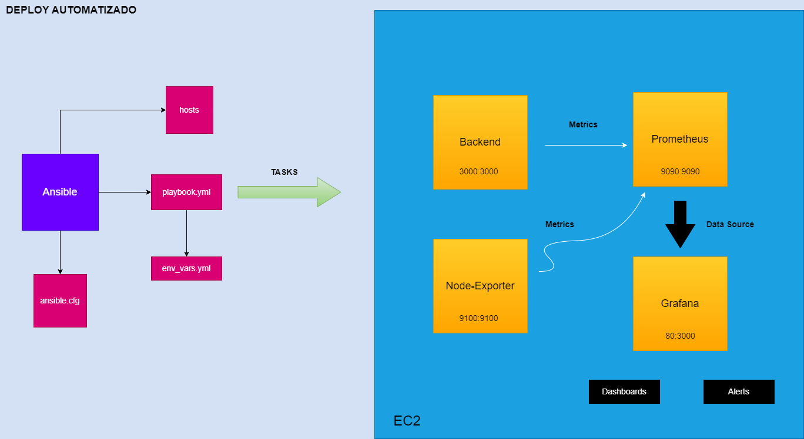

<div aling="center">

# Observabilidade - Stack de Monitoramento e Análise


</div>

<div aling="center">
  

## :8ball: Descrição

Este repositório contém os arquivos e instruções necessários para configurar uma stack de observabilidade, utilizando Prometheus, Node Exporter, Grafana e uma aplicação em Go que simula um petshop. O objetivo dessa atividade é coletar métricas, criar dashboards e alertas para monitorar e analisar o desempenho da aplicação bem como implantar todo ecossistema criado localmente em um servidor remoto na AWS em produção utilizando o Ansible.

<Br>

## :smile: Status do Projeto


## 🚀 Começando

As instruções a seguir são destinadas a ambientes de teste e desenvolvimento. Para implantação em produção, consulte a seção "Implantação em Produção" para obter um guia passo a passo específico. 


### 📋 As tecnologias de pré-requisitos:

<Br>

* **Docker**: É necessário ter o Docker instalado em seu ambiente para executar os componentes da stack em containers isolados. O Docker permite a criação, execução e gerenciamento de containers de aplicativos. 
<Br>

* **Docker Compose**: O Docker Compose é uma ferramenta que facilita a especificação e execução de vários containers em conjunto. Ele permite definir a configuração e as dependências dos containers em um arquivo YAML, simplificando o processo de execução da stack de observabilidade.
<Br>

* **Linux**: A atividade e as instruções fornecidas pressupõem o uso de um sistema operacional Linux. Certifique-se de ter um ambiente Linux configurado e funcional para executar as etapas descritas.
<Br>

* **Ansible**: O Ansible é uma ferramenta de automação que permite configurar e provisionar recursos de maneira consistente em servidores remotos. Será utilizado para criar um playbook Ansible que automatizará a implantação da stack de observabilidade em um servidor remoto AWS.
<Br>

* **Amazon Web Services**: É necessário ter acesso a um servidor remoto na plataforma AWS (Amazon Web Services) para implantar a stack de observabilidade em produção. Isso envolve a configuração de um servidor remoto na AWS e o acesso a ele usando chaves SSH públicas.


## 🔧 Instalação
### :anger: Etapa 1: Clonando o repositório:
<hr>

- Clone este repositório em sua máquina local utilizando o seguinte comando:


```
git clone https://github.com/rc-ventura/nome-do-repositorio.git
```

### :anger: Etapa 2: Instalando o Docker
<hr>

- Instale o Docker em sua máquina utilizando o script oficial Docker

```
$ sudo curl -fsSL https://get.docker.com -o get-docker.sh yes | sudo sh get-docker.sh 

```
<Br>

- Instale o Docker Compose 


```
$ sudo apt-get install docker-compose

```

### :anger: Etapa 3: Executar o Docker Compose
<hr>
 
- Navegue até o diretório do repositório clonado em sua máquina e execute o Docker Compose com o seguinte comando:


```
$ sudo docker-compose up -d
```


<Br>
<Br>

- Esse comando iniciará os containers do Prometheus e Grafana em segundo plano. Os containers serão criados e configurados automaticamente com as imagens do Docker especificadas.

<Br>

- Aguarde até que todos os serviços sejam inicializados. Verifique se os containers estão em execução:


```
$ sudo docker ps
```
<Br>


### :anger: Etapa 4:  Acessar o serviço do Prometheus
<hr>

- Acesse o Prometheus para verificar a coleta de métricas. Abra o navegador e vá para:

```
http://localhost:9090
```
<Br>

- Clique na guia Status e selecione Target. Como o vídeo abaixo:

<Br>

https://github.com/rc-ventura/observability-monitoring-promo-grafana/assets/87483916/d6ee4cab-bbbc-495f-83a0-177012963098


### :anger: Etapa 5:  Acessando as métricas coletadas do serviços pelo Prometheus
<hr>

- Acesse as métricas coletadas pelo Prometheus do Node Exporter e da aplicação em Go. Abra o navegador e vá para:


```
http://localhost:9010/metrics
```
<Br>


<Br>

```
http://localhost:3000/metrics
```
<Br>


- Nestas telas podemos visualizar as métricas que foram coletadas pelo Prometheus. 

      * Porta 9010 - (Node Exporter)
      * Porta 3000 - (Aplicação em Go)

### :anger: Etapa 6:  Configurar o Grafana
<hr>

- Acesse o Grafana para visualizar as métricas em painéis. No navegador, vá para:


```
http://localhost:80/
```

Obs: Lembrando que no docker compose configuramos para host (nossa máquina) a porta 80 e no container a porta 3000. Dito isso ao fazer uma requisição http o docker redirecionará o tráfego para a porta 3000 no container onde é executado o serviço do grafana.

<Br>

```
 **http://localhost:80 --> http://localhost:3000  (bind de portas)**
```

<Br>


### :anger: Etapa 7:  Criando os Dashborads no Grafana
<hr>

1. Acesse o Grafana:
   - Insira suas credenciais de login para acessar o Grafana. 
   - Vá na pasta grafana e busque o arquivo <a href="./grafana/credenciais_grafana.txt"> credenciais.txt </a>

2. Adicionando uma fonte de dados (Data Source):
   - No painel de controle do Grafana, clique em "Configuration" (Configuração) no menu lateral.
   - Selecione "Data Sources" (Fontes de Dados).
   - Clique em "Add data source" (Adicionar fonte de dados).
   - Escolha o tipo de fonte de dados que deseja adicionar.
   - Adicione a fonte de dados Prometheus
   - Configure as informações necessárias para se conectar à fonte de dados. Isso pode incluir o endereço, autenticação e outras configurações específicas da fonte de dados.
   - Apenas modifique o endereço de conexão para:

   <Br>

    ```
      http://prometheus:9090/
    ```
   <Br>

    - Após preencher as configurações, clique em "Save & Test" (Salvar e Testar) para verificar se a conexão com a fonte de dados foi estabelecida com sucesso.
   - Selecione Build Dashboard para criar seu primeiro painel.

   <Br>

https://github.com/rc-ventura/observability-monitoring-promo-grafana/assets/87483916/05e21733-46b3-45a4-adab-8d84bd4c5d27

<Br>

   


<Br>
<Br>

3. Criando um Dashboard:
   - No menu lateral do Grafana, clique em "Create" (Criar) e selecione "Dashboard" (Painel).
   - Na nova página do painel, clique em "Add query" (Adicionar consulta) para adicionar uma consulta de métricas.
   - Selecione a fonte de dados que você configurou anteriormente na lista suspensa "Data Source" (Fonte de Dados).
   - Escreva a consulta para recuperar as métricas desejadas. Por exemplo, você pode usar a consulta do Prometheus para obter a média de uma métrica específica ao longo do tempo.
   - Depois de configurar a consulta, clique em "Apply" (Aplicar) para visualizar os resultados no painel.
   - Personalize a aparência do painel, como o título, intervalo de tempo e tipo de gráfico, usando as opções fornecidas pelo Grafana.
   - Para adicionar mais painéis ao dashboard, repita as etapas acima.
   - Ao concluir a criação do dashboard, clique em "Save" (Salvar) no canto superior direito e forneça um nome para o dashboard.
  
     <Br>

https://github.com/rc-ventura/observability-monitoring-promo-grafana/assets/87483916/62edf18f-cdd2-4ae5-a935-5dd230393ba7

<Br>

4. Navegando entre Dashboards:
   - Para acessar os dashboards criados, você pode usar o menu lateral do Grafana. Clique em "Dashboards" (Painéis) para ver uma lista de todos os dashboards disponíveis.
   - Clique no nome do dashboard para abri-lo e visualizar as métricas e gráficos configurados.

5. Personalizando Dashboards:
   - Além de adicionar consultas de métricas, o Grafana oferece várias opções de personalização para os dashboards. Você pode adicionar painéis, gráficos, tabelas, alertas e outros componentes para exibir as métricas e informações de forma visualmente atraente.
   - Explore as opções fornecidas pelo Grafana para ajustar a aparência, layout e recursos do seu dashboard de acordo com suas necessidades.

<Br>

https://github.com/rc-ventura/observability-monitoring-promo-grafana/assets/87483916/febd9c0d-e3cd-470a-857c-9cf010482324


### :anger: Etapa 8:  Importando os Dashborads no Grafana
<hr>

1. Acesse o Grafana:
   - Insira suas credenciais de login para acessar o Grafana.

2. Acesse a opção de importação:
   - No menu lateral do Grafana, clique em "Dashboards" (Painéis).
   - No canto superior direito da página, clique no ícone "+" para adicionar um novo dashboard.
   - No menu suspenso que aparece, selecione "Import" (Importar).

3. Selecione o arquivo do Dashboard:
   - Clique no botão "Upload .json File" (Enviar arquivo .json) para selecionar o arquivo JSON do dashboard que você deseja importar.
   - Navegue até a localização do arquivo JSON do dashboard em seu computador e clique em "Abrir" para selecioná-lo.

4. Configurações do Dashboard:
   - Na página de importação, você pode definir algumas configurações adicionais para o dashboard.
   - Selecione a fonte de dados (data source) correta para o dashboard. Certifique-se de que a fonte de dados usada no dashboard esteja disponível na sua instância do Grafana.
   - Se necessário, você também pode modificar o nome, pasta de destino e outras opções relacionadas ao dashboard.

5. Importe o Dashboard:
   - Na pasta grafana, existe a subpasta grafana_data. Acessando a subspasta grafana_data, procure a pasta dashboard. Busque pelo arquivo json <a href="./grafana/grafana_data/dashboard/Gova%20Project-1686794862225.json">Gova Project </a> que pode ser importado. 
   - Após selecionar o arquivo JSON e configurar as opções, clique no botão "Import" (Importar) para iniciar o processo de importação.
   - O Grafana irá importar o arquivo JSON do dashboard e criar o dashboard correspondente na sua instância.

6. Verifique o Dashboard:
   - Após a importação, você será redirecionado para a página do dashboard recém-importado.
   - Verifique se todas as visualizações, painéis e configurações estão corretas.

<Br>

https://github.com/rc-ventura/observability-monitoring-promo-grafana/assets/87483916/75ac2b5c-fcf9-4f46-ab59-20df7e207cec


## :airplane: Roadmap
 

- [x] **Preparação e Configuração Inicial**
  - [x] Instalar o Docker em sua máquina local.
  - [x] Configurar acesso à AWS e criar uma instância EC2 para o servidor remoto.
  - [x] Configurar chaves SSH para acessar a instância remota.
  - [x] Conectar-se ao servidor remoto e garantir que esteja pronto para receber a implantação.

- [x] **Configuração da Stack de Observabilidade Localmente**
  - [x] Clonar o repositório da stack de observabilidade em seu ambiente local.
  - [x] Configurar o arquivo docker-compose.yml para definir os serviços Prometheus, Node Exporter, Grafana e a aplicação do petshop.
  - [x] Executar o Prometheus via Docker e configurar o mapeamento de portas.
  - [x] Executar o Node Exporter e configurar sua execução no docker-compose.yml.
  - [x] Executar a aplicação do petshop via docker-compose e configurar o acesso às métricas no Prometheus.
  - [x] Executar o Grafana via Docker e configurar os Data Sources para acessar as métricas do Prometheus.
  - [x] Criar dashboards no Grafana para visualizar as métricas do petshop e do Node Exporter.

- [x] **Implantação Automatizada na AWS**
  - [x] Criar um playbook do Ansible para configurar a instância EC2 com as dependências necessárias.
  - [x] Configurar o playbook do Ansible para instalar o Docker e o Docker Compose na instância remota.
  - [x] Transferir o arquivo docker-compose.yml para a instância remota.
  - [x] Executar o playbook do Ansible para implantar a stack de observabilidade na instância remota.

- [x] **Teste e Monitoramento em Produção**
  - [x] Acessar a instância remota e verificar se a stack de observabilidade foi implantada corretamente.
  - [x] Monitorar as métricas coletadas pelo Prometheus e visualizá-las no Grafana.
  - [ ] Testar a geração de alertas com base nas métricas configuradas.
  - [ ] Realizar ajustes e otimizações com base nos dados de observabilidade coletados.

- [x] **Documentação Oficial do Repositório**
  - [x] Criar uma documentação oficial para o repositório, incluindo instruções de instalação, configuração e uso da stack de observabilidade.
  - [x] Incluir links úteis para recursos relacionados, como documentação do Prometheus, Grafana e Ansible.
  - [ ] Acrescentar exemplos de consultas Prometheus e configurações avançadas no Grafana.
  - [x] Garantir que a documentação esteja atualizada e seja de fácil acesso para os usuários.


## 📦 Implantação
  
  <Br>
  
  

  
    

## :crystal_ball: Tutorial de Instalação do Ansible na Máquina Local

### :anger: 1. Verifique os requisitos de sistema
<hr>

Antes de iniciar a instalação, verifique se sua máquina atende aos requisitos de sistema do Ansible:

- **Sistema operacional**: Ansible é compatível com Linux, macOS e Windows (usando o subsistema Windows para Linux).
- **Python**: Ansible requer Python 3.6 ou superior.

### :anger: 2. Instale o Python

<hr>

Se o Python não estiver instalado na sua máquina, siga as etapas apropriadas para instalar o Python de acordo com o sistema operacional.

- **Linux**: O Python geralmente já está instalado na maioria das distribuições Linux. Verifique executando o comando `python3 --version` no terminal.

- **Windows**: Baixe o instalador do Python a partir do site oficial do Python (https://www.python.org/downloads/) e execute-o para instalar o Python. Certifique-se de marcar a opção "Adicionar Python ao PATH" durante a instalação.

### :anger: 3. Instale o Ansible

<hr>

Agora que o Python está instalado, podemos prosseguir com a instalação do Ansible.

#### Opção 1: Instalação via gerenciador de pacotes

- **Linux**: Use o gerenciador de pacotes do seu sistema para instalar o Ansible. Por exemplo, no Ubuntu, execute o comando:

```
$ sudo apt update
$ sudo apt install ansible
```
<Br>

- **Windows**: Como o Ansible não é nativamente suportado no Windows, você pode usar o subsistema Windows para Linux (WSL). Instale uma distribuição do WSL, como o Ubuntu, e siga as etapas para instalação no Linux.

<Br>

#### Opção 2: Instalação via pip (gerenciador de pacotes do Python)

Se você preferir, pode instalar o Ansible usando o pip, o gerenciador de pacotes do Python.

<Br>

- Abra o terminal ou prompt de comando e execute o seguinte comando:

```
$ sudo pip install ansible
```

### :anger: 4. Verifique a instalação

<hr>

Após a instalação, verifique se o Ansible está corretamente instalado na sua máquina.

<Br>

- Abra o terminal ou prompt de comando e execute o seguinte comando:

```
$ ansible --version
```
<Br>

Isso exibirá a versão do Ansible instalada, confirmando que a instalação foi concluída com sucesso.


Certifique-se de consultar a documentação oficial do Ansible (https://docs.ansible.com/) para aprender mais sobre como usar o Ansible e explorar suas diversas funcionalidades. 
 

## :leaves: Documentação de Implantação


### :anger: 1. Configurando a instância EC2 para deploy com Ansible

<hr>

- Certifique-se de ter uma instância EC2 criada e acessível. Caso tenha alguma dificuldade de configurar uma instância EC2. Visite a  <a href="https://docs.aws.amazon.com"> documentação ofical da AWS. </a>

### :anger: 2. Editando o arquivo ansible.cfg

<hr>

- Após a instalação do Ansible liste o conteúdo da pasta:

```
$ sudo ls /etc/ansible
```
<Br>

- Edite o arquivo  `ansible.cfg`:

```
$ sudo nano /etc/ansible/ansible.cfg
```
- Ao abrir o arquivo, edite as configurações globais do ansible.cfg utilizando como modelo o <a href="https://github.com/rc-ventura/observability-monitoring-promo-grafana/blob/master/ansible/ansible.cfg" > ansible.cfg </a> presente na pasta <a href="https://github.com/rc-ventura/observability-monitoring-promo-grafana/tree/master/ansible">ansible no repositório. </a>  

- Salve com Ctl + O e depois para sair Ctl + X

<Br>

### :anger: 3. Editando o arquivo hosts.ini (Inventário)

<hr>

- No arquivo `hosts.ini`, adicione o endereço IP ou o DNS público da sua instância EC2 sob o grupo `[meuservidor]`.

**Exemplo:**
```
[meuservidor]
meu_ip_ou_dns_publico  ansible_ssh_private_key_file=/caminho/para/a/chave_ssh
```

### :anger: 4. Editando o arquivo env_vars.yml (Variáveis)
<hr>

- No arquivo `env_vars.yml`, defina as seguintes variáveis:


#### Deploy
- `path_dir_deploy`: Caminho para a pasta de deploy no servidor remoto.

#### Prometheus
- `path_dir_prometheus`: Caminho para a pasta do Prometheus no servidor remoto.
- `prometheus_config_src`: Caminho do arquivo `prometheus.yml` localmente.
- `prometheus_config_dest`: Caminho de destino do arquivo `prometheus.yml` no servidor remoto.

#### Docker
- `config_file_src`: Caminho do arquivo `docker-compose.yml` localmente.
- `config_file_dest`: Caminho de destino do arquivo `docker-compose.yml` no servidor remoto.
- `docker_compose_dir`: Diretório onde o `docker-compose.yml` será colocado no servidor remoto.

#### Grafana
- `path_dir_grafana`: Caminho para a pasta do Grafana no servidor remoto.
- `grafana_config_src`: Caminho da pasta de configuração do Grafana localmente.
- `grafana_config_dest`: Caminho de destino da pasta de configuração do Grafana no servidor remoto.

Caso você não queira modificar nenhuma variável se sinta confortável para avançar o tutorial para a próxima seção: Executando o playbook. Apenas se atente a possíveis problemas quanto ao caminho das variáveis locais (localmente) de sua máquina.
### :anger: 5. Executando o playbook
<hr>

- Navegue até a pasta:

```
$ cd /etc/ansible
```
<Br>

- Defina uma variável de ambiente para o camimho do playbook ansible:

```
$ export PATH_TO_PLAYBOOK_ANSIBLE=caminho-para-o-playbook-ansible

```
**Exemplo:**

```
$ export PATH_TO_PLAYBOOK_ANSIBLE= C:\Users\Usuario_Exemplo\Downloads\observability-monitoring-promo-grafana-1.1.0/ansible

```
<Br>


- Execute o playbook do Ansible com o seguinte comando:

```
$ sudo ansible-playbook -i hosts ${PATH_TO_PLAYBOOK_ANSIBLE}/ansible_playbook.yml
```


<Br>
<Br>

- Isso iniciará a configuração do servidor remoto com o Docker, Docker Compose e os serviços especificados no arquivo `docker-compose-deploy.yml` como Prometheus, Node Exporter, Grafana e Petshop.

<Br>

- Após a execução bem-sucedida do playbook, verifique se os containers foram iniciados corretamente executando o comando `docker ps` no servidor remoto.

```
 sudo $ docker ps
```
<Br>


<Br>
<Br>

Acesse o Grafana em `http://seu_ip_ou_dns_publico` para fazer o login e visualizar os dados monitorados pelo Prometheus.

Certifique-se de ajustar as configurações conforme necessário para o seu ambiente específico.

### :mag: Métricas 
<hr>

### Node-Exporter (Memória)

Essas métricas permitem monitorar o consumo de memória do sistema e identificar possíveis problemas de falta de memória ou gargalos.

   - **node_memory_MemTotal**: Indica a quantidade total de memória física do sistema.
   - **node_memory_MemFree**: Indica a quantidade de memória livre disponível no sistema.
   - **node_memory_MemAvailable**: Indica a quantidade de memória disponível para aplicativos e processos.
   - **node_memory_Buffers**: Indica a quantidade de memória usada como cache de buffers do sistema.
   - **node_memory_Cached**: Indica a quantidade de memória usada como cache de páginas de arquivo.
   - **node_memory_Slab**: Indica a quantidade de memória usada para metadados do kernel, como caches de objetos de kernel e estruturas de dados alocadas pelo kernel.
   - **node_memory_Shmem**: Indica a quantidade de memória compartilhada.
   - **node_memory_SReclaimable**: Indica a quantidade de memória que pode ser recuperada (reclaimable) pelo sistema quando necessário.
   - **node_memory_SwapCached**: Indica a quantidade de memória usada como cache de páginas de swap.
   - **node_memory_SwapTotal**: Indica o tamanho total da partição de swap.
   - **node_memory_SwapFree**: Indica a quantidade de espaço livre na partição de swap.

### Node-Exporter (CPU)

Essas métricas permitem monitorar o uso da CPU no sistema, identificando o tempo gasto em diferentes modos e fornecendo insights sobre a carga de trabalho da CPU e possíveis gargalos de desempenho.

   - **node_cpu_user_seconds_total**: Tempo total da CPU gasto no modo de processamento do usuário.
   - **node_cpu_system_seconds_total**: Tempo total da CPU gasto no modo de processamento do sistema.
   - **node_cpu_idle_seconds_total**: Tempo total da CPU ociosa, ou seja, sem atividade.
   - **node_cpu_iowait_seconds_total**: Tempo total da CPU aguardando por operações de entrada e saída (I/O).
   - **node_cpu_irq_seconds_total**: Tempo total da CPU gasto em tratamento de interrupções (IRQ).
   - **node_cpu_softirq_seconds_total**: Tempo total da CPU gasto em tratamento de interrupções de software (softirq).
   - **node_cpu_steal_seconds_total**: Tempo total da CPU gasto em operações de "steal" em ambientes virtualizados.
   - **node_cpu_guest_seconds_total**: Tempo total da CPU gasto em tarefas executadas no modo convidado (guest).
   - **node_cpu_guest_nice_seconds_total**: Tempo total da CPU gasto em tarefas executadas no modo convidado com prioridade "nice" (guest_nice).

### Node-Exporter (Carga de Trabalho)

Essas métricas permitem monitorar a carga média do sistema ao longo do tempo e ajudam a identificar períodos de pico de atividade ou carga excessiva, auxiliando na capacidade de planejamento e na detecção de possíveis problemas de desempenho.

   - **node_load1**: Indica a carga média do sistema nos últimos 1 minuto. Essa métrica reflete a quantidade média de processos em execução ou aguardando em fila durante o último minuto.

   - **node_load5**: Indica a carga média do sistema nos últimos 5 minutos. Essa métrica é uma média da carga do sistema ao longo dos últimos 5 minutos e fornece uma visão mais estável da carga de trabalho do que a métrica de 1 minuto.

   - **node_load15**: Indica a carga média do sistema nos últimos 15 minutos. Essa métrica é uma média da carga do sistema ao longo dos últimos 15 minutos e é útil para identificar tendências de carga de longo prazo.


### Pet Shop


 ### :triangular_flag_on_post: Alertas

  

 ### :computer: Dashboards:  

   
   


<Br>


## :book: Documentação
  
##### <a href="https://docs.aws.amazon.com/"> * Amazon Web Services (AWS)</a> 
##### <a href="https://https://docs.docker.com/"> * Docker</a>
##### <a href="https://docs.docker.com/compose/"> * Docker Compose </a>
##### <a href="https://www.linux.org/"> * Linux </a>
##### <a href="https://prometheus.io/docs/"> * Prometheus</a>
##### <a href="https://grafana.com/docs/"> * Grafana </a>
##### <a href="https://docs.ansible.com/"> * Ansible </a>
##### <a href="https://github.com/prometheus/node_exporter"> * Node Exporter </a>

## :earth_asia: Imagens Docker

#####  * harbor.sflabs.com.br/processo/petshop:latest (Petshop) - imagem com hospedagem privada
##### <a href="https://hub.docker.com/r/prom/prometheus"> * prom/prometheus</a>
##### <a href="https://hub.docker.com/r/grafana/grafana"> * grafana/grafana </a>
##### <a href="https://hub.docker.com/r/prom/node-exporter"> * prom/node-exporter </a>


## 🛠️ Tecnologias

 <div  style="display: inline-block" >

  
 
 
 
 
 
          
</div>


## 🖇️ Colaborando

Por favor, leia o [COLABORACAO.md](https://gist.github.com/usuario/linkParaInfoSobreContribuicoes) para obter detalhes sobre o nosso código de conduta e o processo para nos enviar pedidos de solicitação.

## 📌 Versão

 Para as versões disponíveis, observe as [tags neste repositório](https://github.com/rc-ventura/observability-monitoring-promo-grafana/tags). 

## ✒️ Autores

Mencione todos aqueles que ajudaram a levantar o projeto desde o seu início

* **Rafael Ventura** - *Responsável técnico* - [Dev Ventura](https://linkedin.com/in/dev-ventura)

Você também pode ver a lista de todos os [colaboradores](https://github.com/usuario/projeto/colaboradores) que participaram deste projeto.

## 📄 Licença

Este projeto está sob a licença (sua licença) - veja o arquivo [LICENSE.md](https://github.com/rc-ventura/observability-monitoring-promo-grafana/blob/master/LICENSE) para detalhes.

## 🎁 Expressões de gratidão


---
⌨️ com ❤️ por [Rafael Ventura](https://gist.github.com/rc-ventura) 😊
